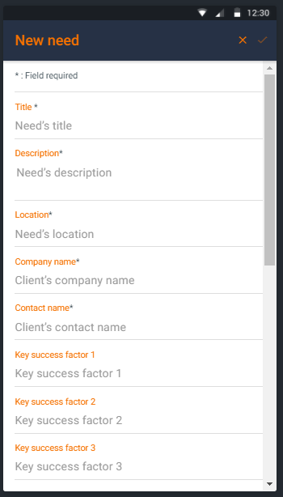
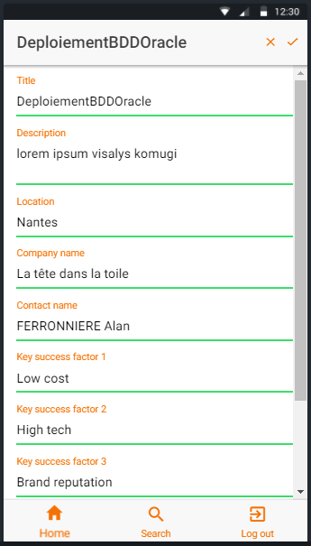

# **GFI PORTABLE APP**  
# *Documentation technique*

## Table des matières
1. [L'application](#application)
    - *[Historique](#app_his)*
    - *[Objectifs](#obj)*
    - *[Visuels](#app_vis)*
    - *[Technique](#app_tec)*
2. [Fonctionnement](#use)
    - *[Page de connexion](#use_con)*
    - *[Navigation](#use_nav)*
    - *[Page d'accueil](#use_hom)*
    - *[Page de création](#use_cre)*
    - *[Page de recherche](#use_sea)*
    - *[Page d'édition](#use_upd)*
3. [Annexes](#annexes)
4. [Crédits](#credit)

# L'application

###  Historique

Le projet de développement de cette application mobile a été mené par quatre étudiants en troisième année à l'EPSI Nantes sous le nom de groupe 'TYBO'. Le projet tiens son origine dans la session Workshop du 2 au 5 octobre 17 organisée par GFI et EPSI Nantes. Ces quatres étudiants sont:
- *Thibaut PRUDHOMME* – Graphisme / Support
- *Yoann MAZZA* – Chef de projet / Développement
- *Benjamin GUILLON* – API / Base de données
- *Olivier MORELLE* – API / Base de données

###  Objectifs

>*Donner aux commerciaux de Gfi un module de saisie et de 	qualification du besoin lors de leurs rendez-vous clientèle pour optimiser 	la vente d’assistance technique.*

###  Visuels
Un détail important a été donné à l'ergonomie et à la facilité d'utilisation pour une meilleur expérience utilisateur.
L'application respecte l'identité de l'entreprise GFI identifiée par les couleurs suivantes :
- *Orange* : `#F57100`
- *Bleu nuit* : `#263145`
- *Gris foncé* : `#304049 `

Tous les logos, images et documents sont les propriétés directes de l'entreprise GFI.

###  Technique

L'application a été réalisée grâce au framework Ionic via le template Super. Il a été développé dans les langages suivants : HTML, CSS, PHP, JS , TS , [...] Ce choix technique a permit à l'application d'être considérée comme hybride car déployable sur Android, Ios et Windows Phone à la fois.

## Fonctionnement

###  Page de connexion [*](#ann_con)

L'application étant réservée en interne aux commerciaux de l'entreprise GFI, l'accès à cet application est restreinte. Vous devez donc disposer d'une `adresse mail` [@gfi.fr]() fournie par l'entreprise à ses salariés ainsi que le `mot de passe` associé. Ce sont ces identifiant personnels que vous devrez utiliser pour vous connecter à l'application.

###  Navigation

La navigation au sein de l'application se fait à travers ce menu de bas de page.
- `Home` : Accès à la [page d'accueil](#use_hom)
- `Search` : Accès à la [page de recherche](#use_sea)
- `Log Out` : Déconnexion du compte en cours (avec confirmation requise)

###  Page d'accueil [*](#ann_hom)

Une fois connecté, vous accédez directement à la page d'accueil. Celle-ci regroupe les cinqs besoins créés le plus récemment indépendamment de leur statut. Vous avez la possibilité d'accéder aux informations de n'importe lequel en cliquant dessus. Vous pouvez également supprimer celui-ci en le glissant sur sa gauche et en cliquant sur le bouton `DELETE`. Enfin vous pouvez accéder depuis cette page à la page de création de besoin en cliquant sur le `+` situé dans la barre supérieure de l'écran.

###  Page de création [*](#ann_cre)

>Insert informations here

###  Page de recherche [*](#ann_sea)

Vous pouvez ici trouver le besoin que vous cherchez. Pour cela vous effectuez votre recherche sur le titre qui a été donné au besoin. Vous pouvez ensuite trier le résultat selon différents critères:
- `Status` : Il existe trois status : **Open** *(jaune)*, **Win** *(vert)* et **Lost** *(rouge)*. Vous pouvez choisir celui qui vous intéresse en cliquant sur les différents dossiers.
- `Title` : range vos résultats par ordre alphabétique au premier clic et le contraire au second
- `Date` : range vos résultats du plus récent au plus ancien au premier clic et l'inverse au second.
- `Company` : range vos résultats par ordre alphabétique selon l'entreprise concernée au premier clic et le contraire au second.

###  Page d'édition [*](#ann_upd)

>Insert informations here

##  Annexes

   

  

 

##  Crédits

Entreprise *[GFI](http://www.gfi.world/fr/)*

Ecole *[EPSI Nantes](http://www.epsi.fr/campus/campus-de-nantes/)*
